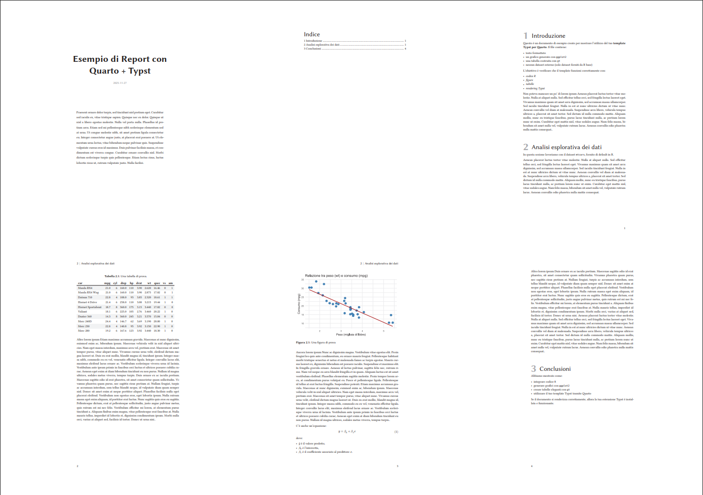

# Template Quarto-DataReport-Typst

Un template Quarto + Typst pensato per la produzione di report brevi, articoli tecnici e documenti con numerosi grafici e tabelle.
Il design riprende lo stile tipografico di classici layout LaTeX come ClassicThesis e ArsClassica, adattandolo all’ecosistema Quarto e a documenti moderni in PDF.


## Caratteristiche principali

- Numerazione automatica di capitoli, figure, tabelle ed equazioni
- Header e footer personalizzati
- Stile uniforme per testi, figure, tabelle e blocchi di codice
- Margini ottimizzati e spaziatura equilibrata tra gli elementi
- Layout pensato per documenti tecnici compatti

[](https://andreabz.github.io/quarto-datareport-typst/template.pdf)

## Installazione

Per aggiungere il template a una directory esistente:

```bash
quarto install extension andreabz/quarto-datareport-typst
```

Oppure puoi creare un nuovo progetto basato sul template con un file `.qmd`:

```bash
quarto use template andreabz/quarto-datareport-typst
```

Per replicare il template è necessario copiare la struttura e il contenuto della cartella `static/fonts` all'interno della cartella principale del progetto.

## Utilizzo

1. Scrivi il tuo documento `.qmd` specificando il formato nell'intestazione `yaml`:

```yaml
format: 
  datareport-typst:
    css-property-processing: none
    font-paths: static/fonts/
```
2. Renderizza il documento:

```bash
quarto render documento.qmd
```

Il PDF risultante utilizzerà automaticamente layout, font e regole tipografiche del template.

## Requisiti

- Quarto >= 1.6.37
- Typst >= 0.11
- R >= 4.4.3